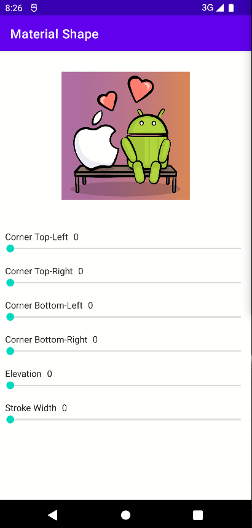

# Simple CardView Using MaterialShapeDrawable

[](http://developer.android.com/index.html)
[](https://search.maven.org/artifact/com.mikhaellopez/circularimageview)



---

# Usages

### Gradle

Add below codes to your **root** `build.gradle` file (not your module build.gradle file).

```gradle
allprojects {
    repositories {
        mavenCentral()
    }
}
```

And add a dependency code to your **module**'s `build.gradle` file.

```gradle
dependencies {
    implementation 'dev.arpan:awesome-cardview:latest'
}
```

# Sample XML

```xml
 <dev.arpan.card.AwesomeCardView
     android:id="@+id/view"
     android:layout_width="wrap_content"
     android:layout_height="wrap_content"
     android:layout_marginTop="32dp"
     app:layout_constraintEnd_toEndOf="parent"
     app:layout_constraintStart_toStartOf="parent"
     app:layout_constraintTop_toTopOf="parent"
     app:acv_cornerSize="26dp"
     app:acv_elevation="16dp"
     app:acv_shadowColor="#FF7D71"
     app:acv_strokeColor="@color/black"
     app:acv_strokeWidth="2dp">

     <ImageView
         android:layout_width="200dp"
         android:layout_height="200dp"
         app:srcCompat="@drawable/image" />
 </dev.arpan.card.AwesomeCardView>
```

# Attributes

```xml
<attr name="acv_backgroundColor" format="color" />
<attr name="acv_cornerSize" format="dimension" />
<attr name="acv_cornerSizeTopLeft" format="dimension" />
<attr name="acv_cornerSizeTopRight" format="dimension" />
<attr name="acv_cornerSizeBottomLeft" format="dimension" />
<attr name="acv_cornerSizeBottomRight" format="dimension" />
<attr name="acv_elevation" format="dimension" />
<attr name="acv_shadowColor" format="color" />
<attr name="acv_strokeColor" format="color" />
<attr name="acv_strokeWidth" format="dimension" />
```

## Found this useful? :heart:

Support it by joining **[stargazers](https://github.com/Bloody-Badboy/CardView/stargazers)** for this repository. :star: <br>

# License

```xml
Copyright 2022 Arpan Sarkar

Licensed under the Apache License, Version 2.0 (the "License");
you may not use this file except in compliance with the License.
You may obtain a copy of the License at

   http://www.apache.org/licenses/LICENSE-2.0

Unless required by applicable law or agreed to in writing, software
distributed under the License is distributed on an "AS IS" BASIS,
WITHOUT WARRANTIES OR CONDITIONS OF ANY KIND, either express or implied.
See the License for the specific language governing permissions and
limitations under the License.
```
